# Arquitectura Actual - SmartPYME

## 📋 Índice
1. [Arquitectura General](#arquitectura-general)
2. [Backend - Laravel](#backend---laravel)
3. [Frontend - Angular](#frontend---angular)
4. [Base de Datos](#base-de-datos)
5. [Integraciones Externas](#integraciones-externas)
6. [Flujo de Autenticación](#flujo-de-autenticación)
7. [Flujo de Datos](#flujo-de-datos)

---

## Arquitectura General

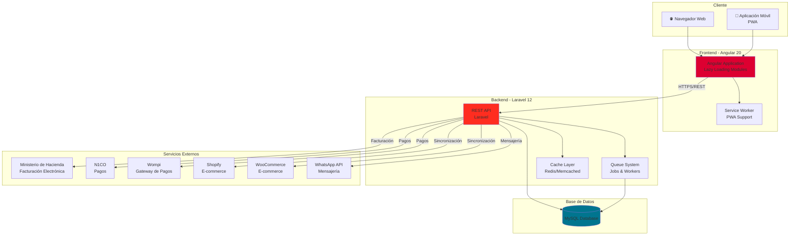

---

## Backend - Laravel

### Estructura de Directorios y Módulos Principales

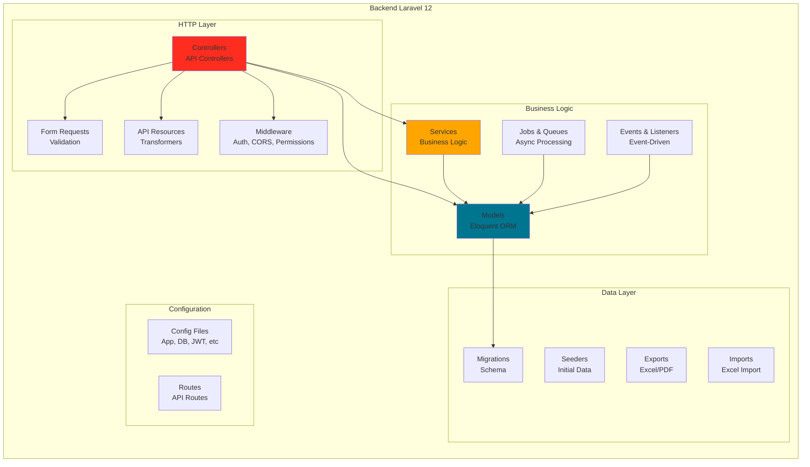

### Módulos Principales del Backend

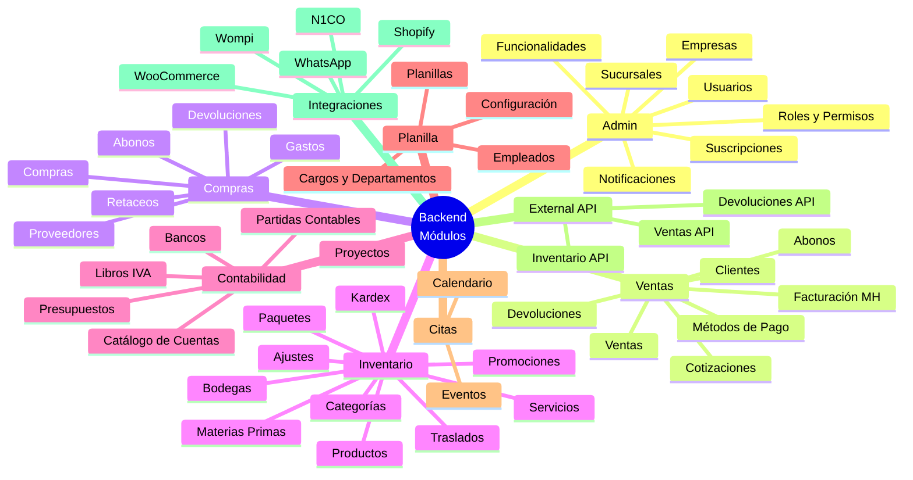

### Controladores Principales

```mermaid
graph TD
    subgraph "API Controllers"
        AdminCtrl[Admin Controllers]
        VentasCtrl[Ventas Controllers]
        ComprasCtrl[Compras Controllers]
        InventarioCtrl[Inventario Controllers]
        ContabilidadCtrl[Contabilidad Controllers]
        PlanillaCtrl[Planilla Controllers]
        ExternalCtrl[External API Controllers]
    end
    
    subgraph "Admin Controllers"
        EmpresasCtrl[EmpresasController]
        UsuariosCtrl[UsuariosController]
        RolesCtrl[RolePermissionController]
        SucursalesCtrl[SucursalesController]
        SuscripcionesCtrl[SuscripcionesController]
        MHCtrl[MHController<br/>Facturación Electrónica]
    end
    
    subgraph "Ventas Controllers"
        VentasMainCtrl[VentasController]
        ClientesCtrl[ClientesController]
        CotizacionesCtrl[CotizacionesController]
        DevolucionesCtrl[DevolucionesController]
        AbonosCtrl[AbonosController]
        FacturacionCtrl[FacturacionController]
    end
    
    subgraph "Compras Controllers"
        ComprasMainCtrl[ComprasController]
        ProveedoresCtrl[ProveedoresController]
        GastosCtrl[GastosController]
        RetaceosCtrl[RetaceosController]
    end
    
    subgraph "Inventario Controllers"
        ProductosCtrl[ProductosController]
        CategoriasCtrl[CategoriasController]
        BodegasCtrl[BodegasController]
        TrasladosCtrl[TrasladosController]
        KardexCtrl[KardexController]
        PromocionesCtrl[PromocionesController]
    end
    
    AdminCtrl --> EmpresasCtrl
    AdminCtrl --> UsuariosCtrl
    AdminCtrl --> RolesCtrl
    AdminCtrl --> MHCtrl
    VentasCtrl --> VentasMainCtrl
    VentasCtrl --> ClientesCtrl
    VentasCtrl --> FacturacionCtrl
    ComprasCtrl --> ComprasMainCtrl
    InventarioCtrl --> ProductosCtrl
```

### Modelos Principales

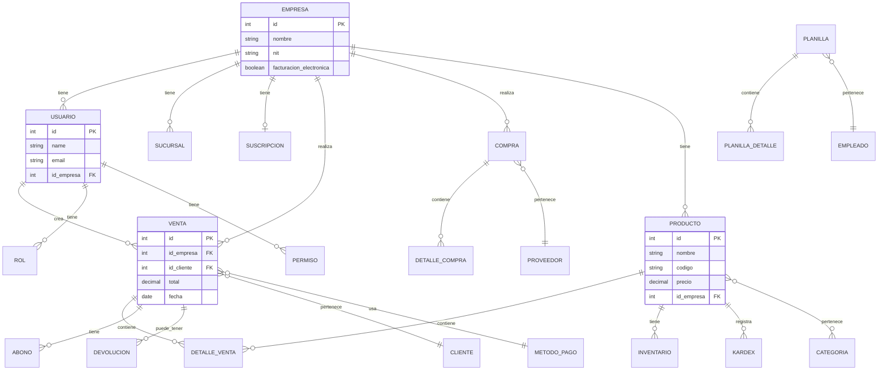

### Middleware y Seguridad

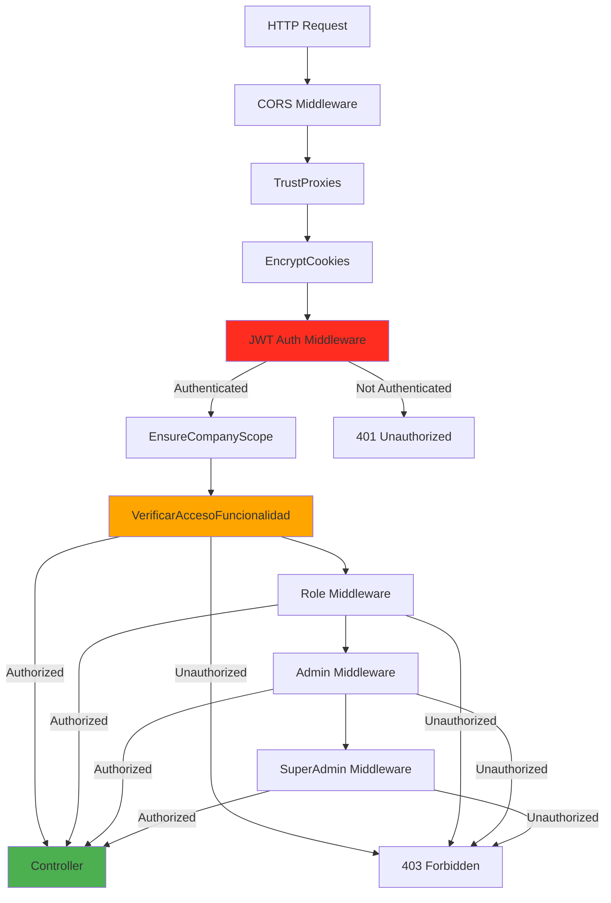

### Jobs y Colas

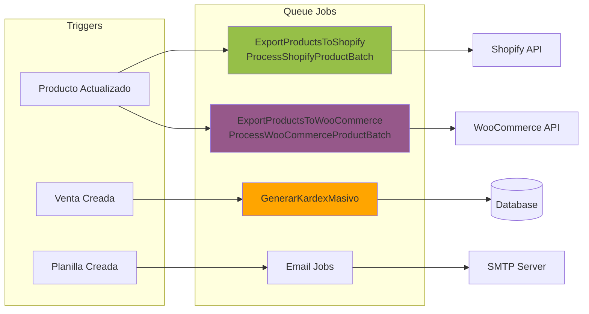

---

## Frontend - Angular

### Estructura de Módulos

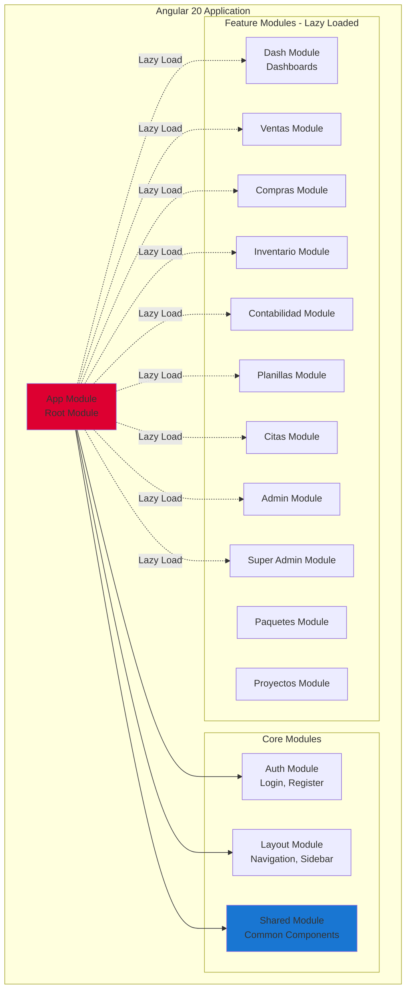

### Módulos del Frontend - Detalle

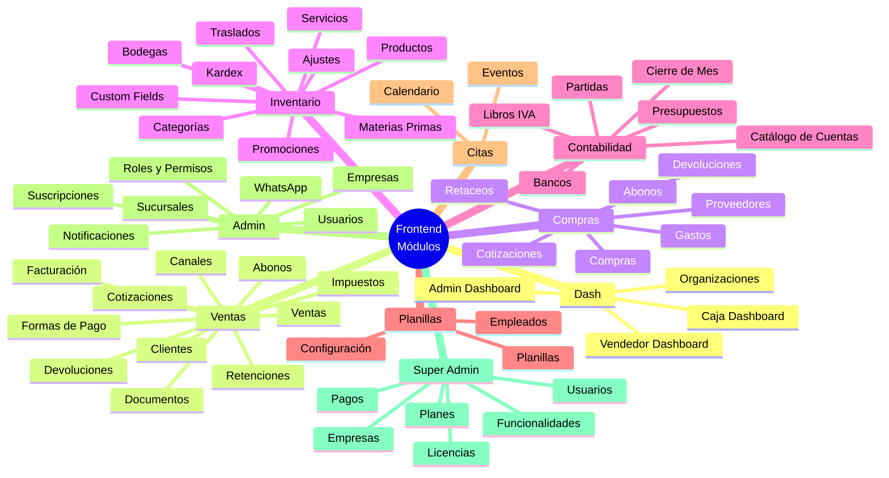

### Servicios Principales

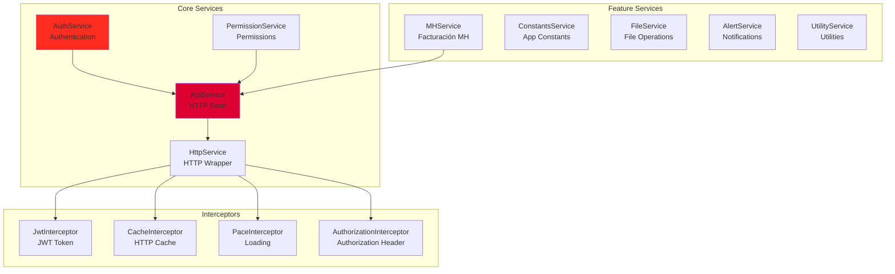

### Guards y Routing

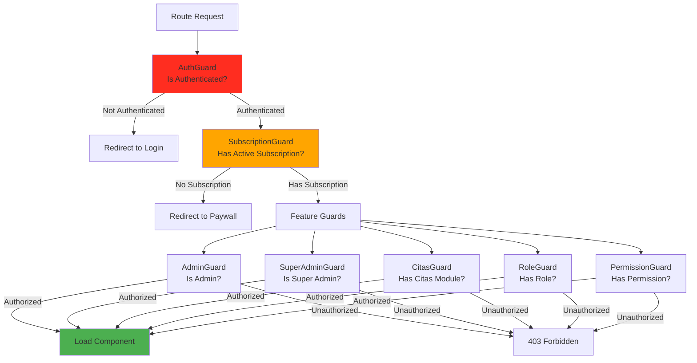

---

## Base de Datos

### Principales Entidades

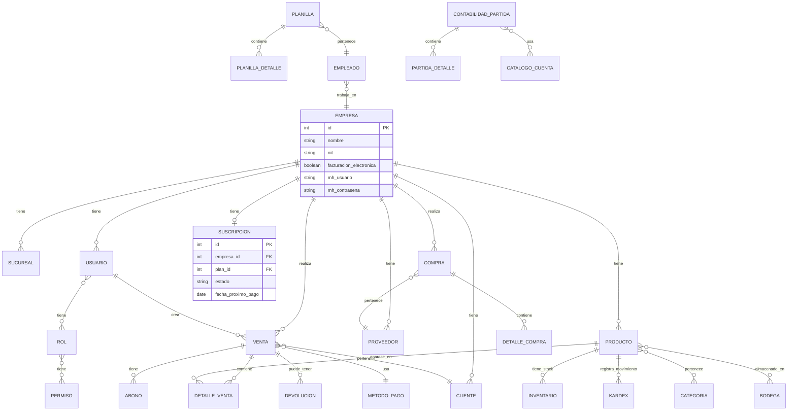

---

## Integraciones Externas

### Servicios Externos Integrados

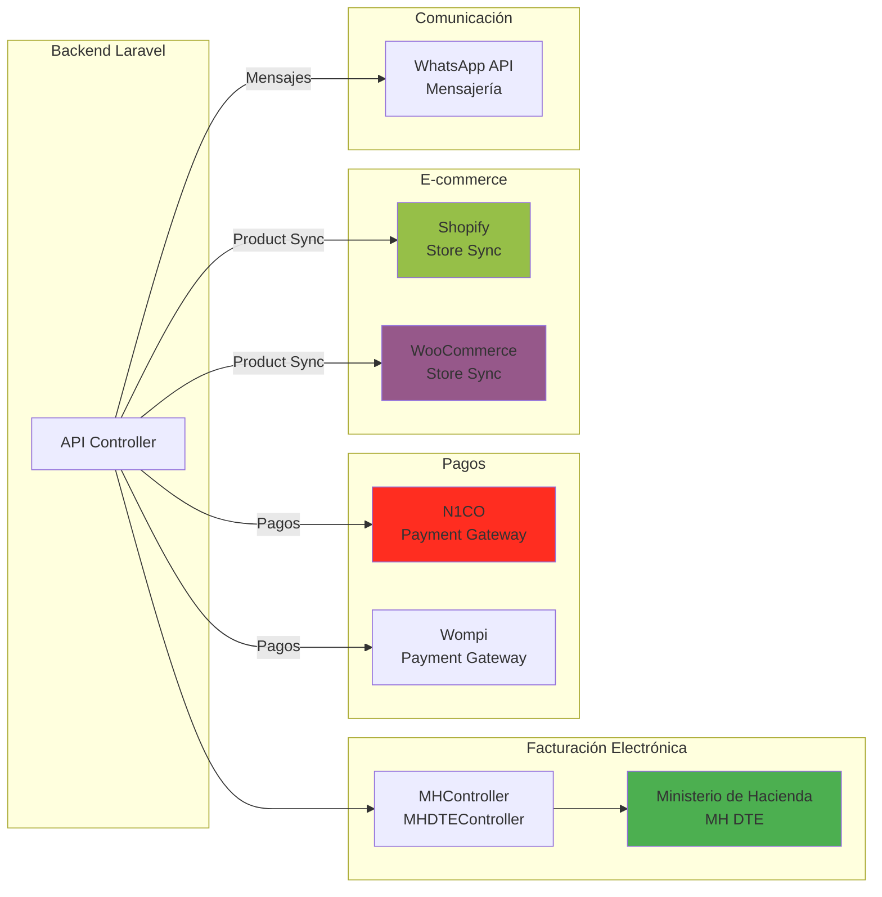

### Flujo de Integración con Shopify/WooCommerce

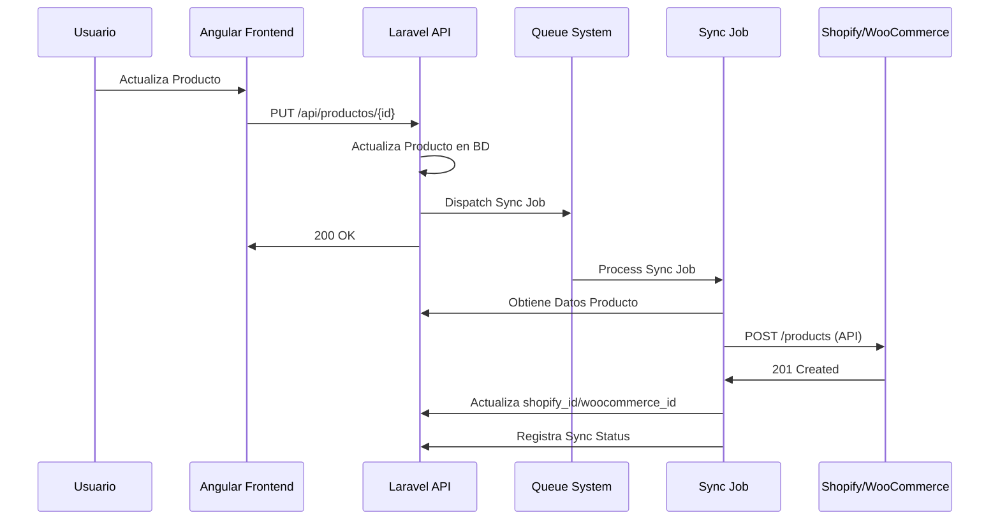

---

## Flujo de Autenticación

### Autenticación JWT

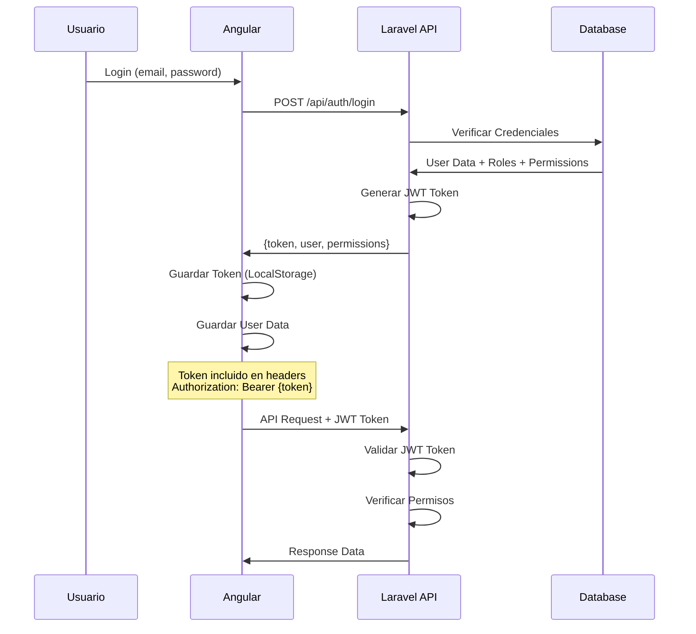

### Autorización y Permisos

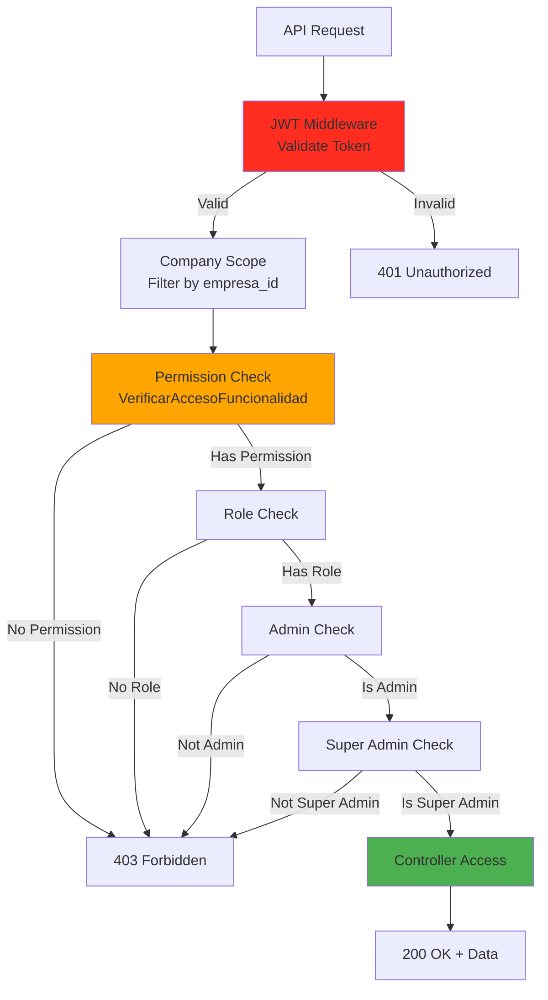

---

## Flujo de Datos

### Flujo General de una Operación

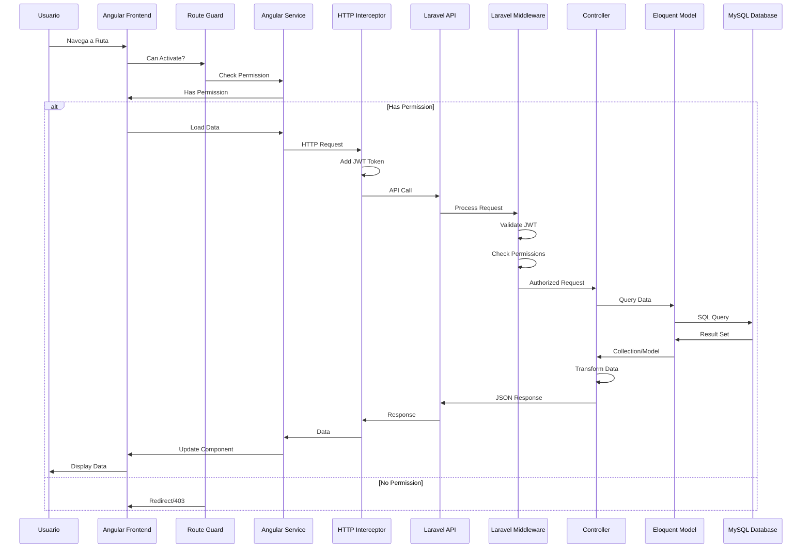

### Flujo de Facturación Electrónica (MH)

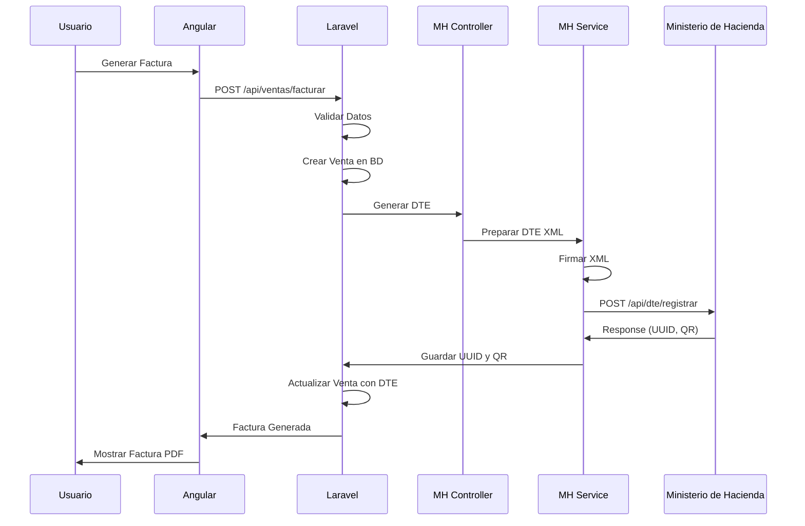

---

## Tecnologías Utilizadas

### Backend Stack
- **Framework**: Laravel 12
- **PHP**: ^8.2|^8.3|^8.4
- **Base de Datos**: MySQL
- **Autenticación**: JWT (php-open-source-saver/jwt-auth)
- **Permisos**: Spatie Laravel Permission
- **PDF**: DomPDF, mPDF
- **Excel**: Maatwebsite Excel
- **Imágenes**: Intervention Image
- **Códigos de Barras**: Picqer PHP Barcode Generator
- **QR Codes**: SimpleSoftwareIO Simple-QRCode
- **HTTP Client**: Guzzle
- **AWS SDK**: Para almacenamiento en S3

### Frontend Stack
- **Framework**: Angular 20
- **TypeScript**: 5.8.3
- **UI Libraries**: 
  - Bootstrap 5
  - ngx-bootstrap
  - FontAwesome
- **Charts**: Chart.js, Chartist
- **Forms**: Angular Reactive Forms
- **HTTP**: Angular HttpClient
- **Routing**: Angular Router (Lazy Loading)
- **PWA**: Angular Service Worker
- **Masks**: ngx-mask
- **Notifications**: SweetAlert2
- **Calendar**: FullCalendar
- **PDF Viewer**: ng2-pdf-viewer

### Servicios Externos
- **Facturación**: Ministerio de Hacienda (MH DTE)
- **Pagos**: N1CO, Wompi
- **E-commerce**: Shopify, WooCommerce
- **Mensajería**: WhatsApp API

---

## Notas de Arquitectura

### Patrones Utilizados
1. **MVC (Model-View-Controller)**: Separación clara de responsabilidades
2. **Repository Pattern**: Uso de Eloquent Models como repositorios
3. **Service Layer**: Lógica de negocio en servicios
4. **Resource Transformers**: Transformación de datos para API
5. **Middleware Pipeline**: Autenticación y autorización
6. **Queue Jobs**: Procesamiento asíncrono de tareas pesadas
7. **Event-Driven**: Eventos y listeners para acciones secundarias
8. **Lazy Loading**: Módulos Angular cargados bajo demanda

### Características de Seguridad
- Autenticación JWT
- Middleware de autorización por roles y permisos
- Scope por empresa (multi-tenancy)
- CORS configurado
- Validación de datos en Form Requests
- Sanitización de inputs

### Optimizaciones
- Lazy Loading de módulos Angular
- Cache HTTP en frontend
- Queue system para tareas pesadas
- Indexación de base de datos
- Service Worker para PWA

---

## Exportación a PDF

Este documento puede ser exportado a PDF usando:

1. **Mermaid CLI**: `npm install -g @mermaid-js/mermaid-cli`
   ```bash
   mmdc -i ARQUITECTURA_ACTUAL.md -o ARQUITECTURA_ACTUAL.pdf
   ```

2. **Pandoc**: 
   ```bash
   pandoc ARQUITECTURA_ACTUAL.md -o ARQUITECTURA_ACTUAL.pdf
   ```

3. **Markdown a PDF Online**: Usar servicios como markdown-pdf, md-to-pdf, etc.

4. **VS Code Extension**: Instalar extensiones como "Markdown PDF" o "Markdown Preview Enhanced"

Los diagramas Mermaid se renderizarán correctamente en la mayoría de visualizadores de Markdown modernos (GitHub, GitLab, VS Code, etc.).

